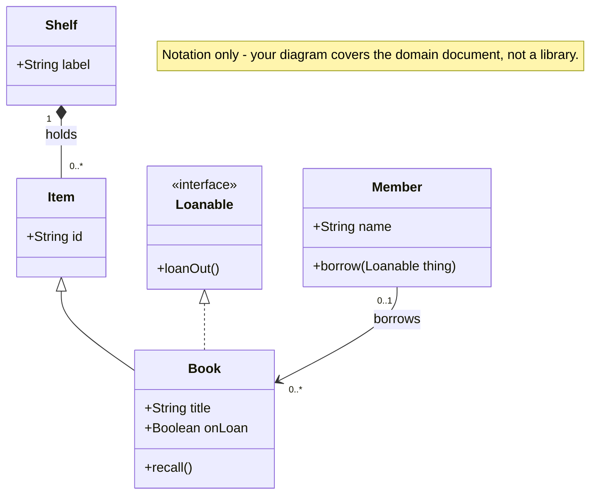
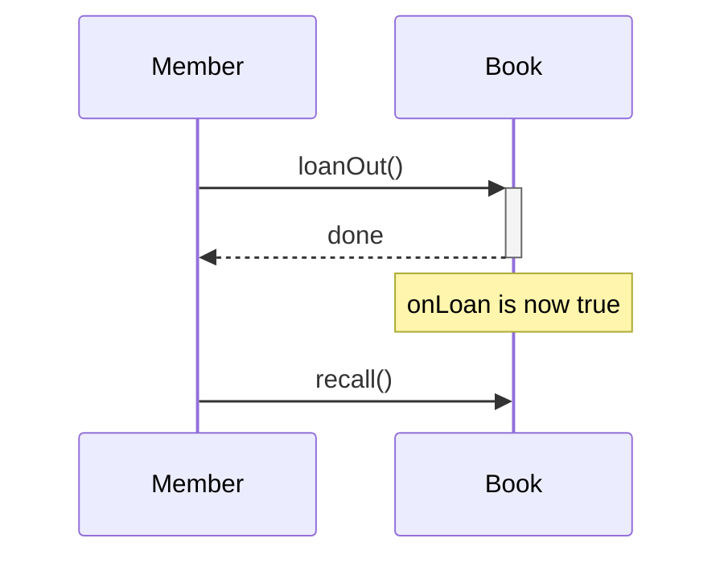

# design/

Your class diagram, your two sequence diagrams, and your design rationale go here. Together they
carry most of the grade:
rubric items 2 through 6 (58%). Part A of the in-class session asks about both, with the assistant
off, and Part B extends the diagram — so both had better be yours.

## What goes here

| | |
|---|---|
| Your class diagram | **Mermaid script**, one `classDiagram` — e.g. `design/model.mmd`, or a `mermaid` code block in a Markdown file. What it must cover is the seven required items in §4 of the handout; keep that list beside you while you draw. |
| Your two sequence diagrams | **Mermaid script**, one `sequenceDiagram` each — e.g. `design/expiry.mmd` and `design/put-value.mmd`. The two scenarios are listed in §4 of the handout. Every message must be an operation in your class diagram. |
| `rationale.md` | **Prose, in Markdown.** Create this file. The eight questions it must answer are in §7 of the handout, along with the rejected-alternatives and stated-misfits requirements. It carries the most weight of anything you make for the take-home. |
| Notes | Anything you want on record: decisions made where the domain document was silent, questions you mean to ask, sketches of alternatives. Not graded directly — but the rationale is graded partly on *rejected alternatives*, and notes are where those usually come from. |

Your marked-up copy of `OPTIONS-MARKETS.md` stays **at the repository root**, not here — its commit
history is the evidence for rubric item 1, and it reads most clearly as a straight line through
reading passes.

## The class diagram — what "complete" means

Coverage is judged against §4 of the handout, item by item. Two things to check before you call it
done:

- **Both relationship kinds show.** Inheritance ("is-a") and composition ("part-of") must be visibly
  different — different arrowheads, not the reader's memory of which line meant what.
- **The boxes carry content.** Attributes, operations, and multiplicities on the relationships that
  need them. A diagram of empty boxes connected by lines is a table of contents, not a model.

Notes attached to classes — one line saying why a class exists or what it is forbidden from knowing —
are worth using sparingly. They are the cheapest place to leave a trace of a decision, and the
rationale is easier to write when the decisions are still findable.

## Mermaid — required, not a preference

**Every diagram you submit is Mermaid script** ([mermaid.js.org](https://mermaid.js.org/)). Not
PlantUML, not Graphviz, and never only an image.

Your submission is a single text bundle (§10 of the handout). A diagram that exists only as a
`.png`, `.jpg`, `.svg`, or `.drawio` file **cannot be graded** — the bundler lists such files by
name and skips their contents. Drawing in a GUI tool is fine *provided* what you commit is the
Mermaid script. After running `munger.py`, check the `FILES NOT BUNDLED` section: if anything from
`design/` is listed there, fix it before you submit.

The script also has to **parse** — rubric item 6. A diagram with a syntax error renders as nothing,
so paste it into a renderer (WALKTHROUGH step 4) after every substantial change. Mermaid is diffable
in git, renders in `.md` previews, and is the notation Part B's class diagram is typed in during the
in-class session, so two weeks of fluency in it is two weeks of rehearsal.

## Notation, in one sketch

Everything the handout asks the diagram to show, in one Mermaid `classDiagram` — traced on a
library so that the only thing you can take from it is the notation:

````

````

That is: a class box with attributes and operations (`+` public, `-` private); `<|--` inheritance,
with the hollow arrowhead at the parent; `<|..` realization of an interface; `*--` composition,
with the filled diamond at the whole; and an association with multiplicities on both ends and a
label. Your diagram will use these same shapes for very different content.

A sequence diagram, traced on the same library. Each message is an operation from the class
diagram above:

````

````

`->>` is a call and `-->>` a return; `+` and `-` open and close an activation bar. `loop ... end`
and `alt ... else ... end` are available when a scenario repeats or branches.

## Why the rationale is the heavyweight

A class diagram of this domain can be generated in seconds. The rationale cannot, because it has to
be true of *your* diagram: the eight questions in §7 of the handout all have the form "you made a
choice here — what does it cost you?" An answer written before the choice was made is a guess; an
answer written after is evidence that the model is yours. That is also why Part A of the in-class
session asks about it with the assistant off — it is the deliverable hardest to produce without
understanding the model.